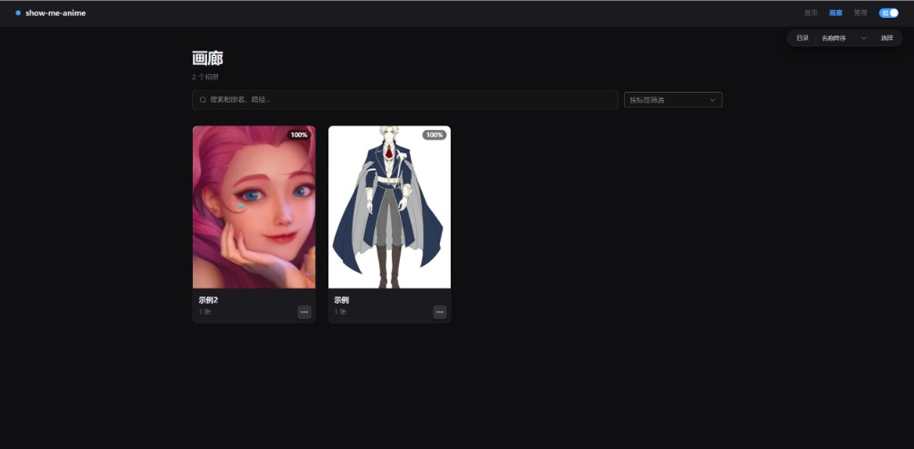
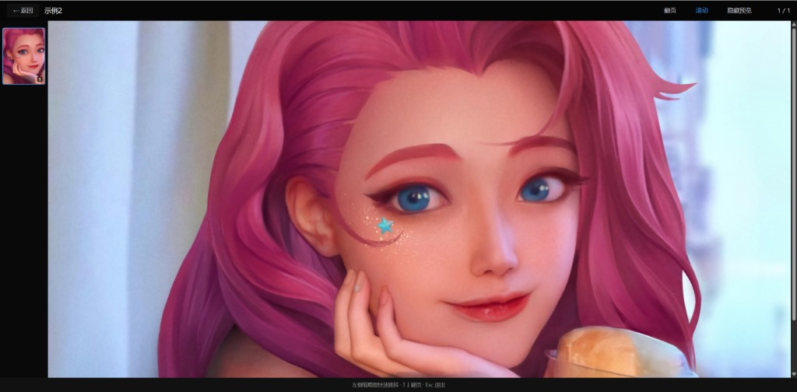

# show-me-anime

本地图片画廊，用于浏览和管理漫画、组图等按文件夹组织的图片集合。

## 功能概览

- 以文件夹 / 压缩包为集合单位组织内容
- Web 页面浏览、阅读、搜索与标签管理
- 增量 / 全量扫描索引到 SQLite
- 目录监听（watchdog）自动触发增量扫描
- 集合级 FTS 搜索与自然排序阅读

详细设计、数据模型与 API 说明见 **[docs/project-overview.md](docs/project-overview.md)**。

## 截图

**画廊浏览** — 相册网格、搜索与标签筛选



**阅读器** — 翻页 / 滚动模式，左侧缩略图可隐藏



## 技术栈

| 层级 | 选型 |
|------|------|
| 后端 | Python + FastAPI |
| 数据库 | SQLite + FTS5 |
| 前端 | Vue 3 + Vite + Element Plus |

## Docker 部署（推荐）

镜像采用**多阶段构建**：Node 阶段编译前端，最终镜像仅含 Python 运行时与静态资源，不含 Node/npm 与构建工具。

### 前置要求

- [Docker](https://docs.docker.com/get-docker/) 20.10+
- [Docker Compose](https://docs.docker.com/compose/install/) v2（可选，推荐）

### 1. 准备数据目录

在项目根目录执行（若已有可跳过）：

```bash
mkdir -p gallery data
```

将图片放入 `gallery/` 子文件夹，例如 `gallery/comic-a/1.jpg`。

### 2. 使用 Docker Compose 启动

```bash
docker compose up -d --build
```

浏览器打开 http://localhost:8000

常用命令：

```bash
# 查看日志
docker compose logs -f

# 停止
docker compose down

# 重新构建并启动
docker compose up -d --build
```

### 3. 仅使用 Docker 命令

```bash
docker build -t show-me-anime:latest .

docker run -d \
  --name show-me-anime \
  -p 8000:8000 \
  -v "%cd%\gallery:/data/gallery" \
  -v "%cd%\data:/app/data" \
  -e GALLERY_ROOT=/data/gallery \
  -e THUMB_DIR=/app/data/thumbs \
  -e DATABASE_URL=sqlite:////app/data/gallery.db \
  show-me-anime:latest
```

Linux / macOS 将 `%cd%` 换为 `$(pwd)`。

### 4. 首次使用：扫描索引

容器启动后，在管理页点击「扫描」，或执行：

```bash
curl -X POST http://localhost:8000/api/scan/trigger
```

### Docker 目录与卷说明

| 宿主机路径 | 容器路径 | 说明 |
|-----------|----------|------|
| `./gallery` | `/data/gallery` | 图片/压缩包源目录 |
| `./data` | `/app/data` | SQLite 数据库、缩略图缓存、`settings.json` |

环境变量可在 `docker-compose.yml` 的 `environment` 中修改；也可在 `./data/settings.json` 写入配置（优先级更高）。

### 5. 从 Docker Hub 拉取（无需本地构建）

预构建镜像：[yaliyhub/show-me-anime](https://hub.docker.com/r/yaliyhub/show-me-anime)

```bash
mkdir -p gallery data

docker pull yaliyhub/show-me-anime:latest

docker run -d \
  --name show-me-anime \
  -p 8000:8000 \
  -v "%cd%\gallery:/data/gallery" \
  -v "%cd%\data:/app/data" \
  -e GALLERY_ROOT=/data/gallery \
  -e THUMB_DIR=/app/data/thumbs \
  -e DATABASE_URL=sqlite:////app/data/gallery.db \
  yaliyhub/show-me-anime:latest
```

或使用 Compose：

**有源码、本地构建**（项目根目录）：

```bash
docker compose up -d --build
```

**仅拉 Hub 镜像**（任意目录，只需本 compose 文件；先 `mkdir -p gallery data/thumbs data`，再改 `docker-compose.hub.yml` 中 volumes 路径）：

```bash
docker compose -f docker-compose.hub.yml pull
docker compose -f docker-compose.hub.yml up -d
```

当前仓库的 `docker-compose.yml` 含 `build: .`，适合开发；`docker-compose.hub.yml` 只拉 `yaliyhub/show-me-anime:latest`，适合服务器部署。

### 6. 构建并推送到 Docker Hub

Hub 用户名须**全小写**，推送时使用 `docker.io/` 前缀：

```bash
docker compose build

docker tag show-me-anime:latest docker.io/yaliyhub/show-me-anime:latest
docker push docker.io/yaliyhub/show-me-anime:latest
```

可选：同时打版本号 tag，便于回滚：

```bash
docker tag show-me-anime:latest docker.io/yaliyhub/show-me-anime:1.0.0
docker push docker.io/yaliyhub/show-me-anime:1.0.0
```

> 注意：不要使用 `yaliyHub` 这类大小写混写 tag，Docker 可能将其误判为 registry 地址导致推送失败。

## 本地开发

### 1. 后端

```bash
python -m venv .venv
.venv\Scripts\activate
pip install -r backend/requirements.txt

# 启动 API（默认 http://127.0.0.1:8000）
cd backend
..\.venv\Scripts\uvicorn app.main:app --reload --host 0.0.0.0 --port 8000
```

### 2. 前端

```bash
cd frontend
npm install
npm run dev
```

浏览器打开 http://127.0.0.1:5173 ，Vite 会将 `/api` 代理到后端。

生产构建后也可由后端托管静态文件（与 Docker 镜像行为一致）：

```bash
cd frontend && npm run build
cd ../backend && uvicorn app.main:app --host 0.0.0.0 --port 8000
# 访问 http://127.0.0.1:8000
```

### 3. 测试

```bash
cd backend
..\.venv\Scripts\pytest -q
```

## 配置

复制 `.env.example` 为 `.env`，或复制 `config.yaml.example` 为 `config.yaml`。

| 环境变量 | 默认值 | 说明 |
|----------|--------|------|
| `GALLERY_ROOT` | `./gallery` | 图片根目录 |
| `THUMB_DIR` | `./data/thumbs` | 缩略图缓存目录 |
| `DATABASE_URL` | `sqlite:///./data/gallery.db` | 数据库连接 |
| `WATCH_ENABLED` | `true` | 是否监听画廊目录变更 |

未配置时使用默认值。可将图片放入 `./gallery/` 目录进行试用。

配置优先级：`data/settings.json` > `.env` > `config.yaml` > 默认值。

## 安全说明

本应用**未内置登录或权限控制**。管理页（扫描、配置、清理任务记录等）与浏览 API 默认可被同一网络内的任何人访问。

### 部署建议

- **不要**将 `:8000` 直接暴露到公网；仅在内网或本机使用。
- 若需远程访问，请在前方加 **Nginx / Caddy 等反向代理**，并配置 **Basic Auth、OAuth 或 VPN**。
- Docker 部署时，确保 `gallery/`、`data/` 卷权限合理，避免容器以过高权限读写宿主机目录。

### 仓库与隐私

- **不要提交**：`.env`、`data/`、`gallery/`、`*.db` 及任何图片/压缩包内容（已在 `.gitignore` 中）。
- 复制 `.env.example` 为 `.env` 后仅在本地使用，勿将真实路径或密钥写入仓库。
- 若仓库曾误提交敏感信息，改 public 前需清理 Git 历史并轮换相关密钥。

## 许可证

MIT
